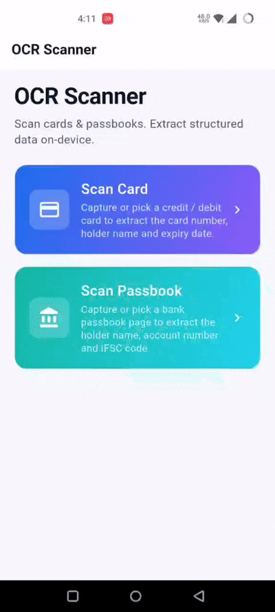
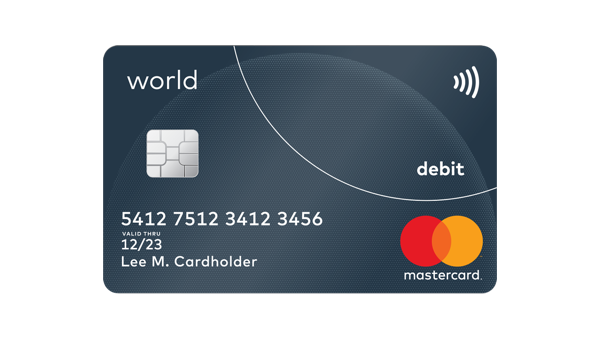
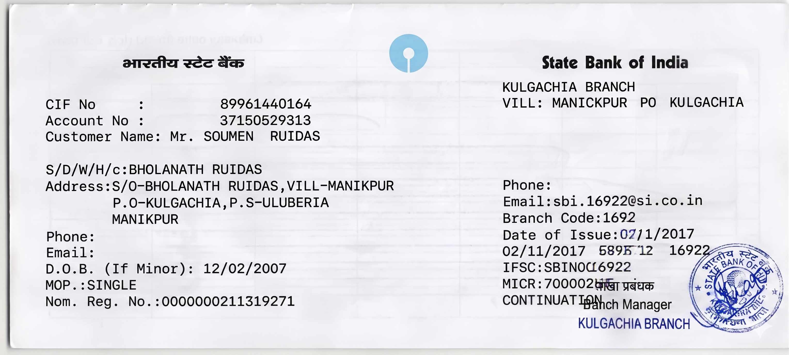

# OCR Scanner — Flutter Interview Assignment

A Flutter app that scans **credit / debit cards** and **bank passbooks**, runs on-device OCR (Google ML Kit), and extracts structured fields with **hand-written parsers** — no parsing libraries.

Built to demonstrate production-minded Flutter work: clean architecture, feature-first layout, Cubit state management, DI, reusable widgets, and broad unit-test coverage.

---

## Download APK (no build required)

Install and try the app on a physical Android device:

**[Download app-debug.apk (Google Drive)](https://drive.google.com/file/d/1MOR8m0PKoG2pG0GK9FpW-jhWdxy48IAs/view?usp=sharing)**

> ML Kit needs a real device (or a supported emulator image). Camera and storage permissions are required.

---

## Demo & test assets

Use these bundled samples when reviewing or testing without a physical card/passbook:

| Asset | Path | Use |
| ----- | ---- | --- |
| App walkthrough | `assets/demo/ocr_interview_assignment.gif` | End-to-end flow (card + passbook) |
| Debit card | `assets/demo/debit-card-sample.png` | Card scanner — gallery/crop/OCR |
| Passbook | `assets/demo/passbook-sample.png` | Passbook scanner — gallery/crop/OCR |

### App walkthrough



### Sample images

| Debit card | Passbook |
| ---------- | -------- |
|  |  |

---

## What it does

**Card scanner** — card number (masked), holder name, expiry (`12/25`, `12-25`, `1225`), brand (Visa / MasterCard / Amex / RuPay / Discover), **Luhn validation**.

**Passbook scanner** — account holder, account number (mobile / IFSC-tail excluded), IFSC (`[A-Z]{4}0[A-Z0-9]{6}` with O↔0 repair), bank name and branch.

**Pipeline** — pick image → crop → ML Kit OCR → text normalisation (OCR confusables, noise removal, duplicate-line collapse) → manual parser → typed result UI.

---

## Tech stack

| Layer | Choice |
| ----- | ------ |
| State | `flutter_bloc` / `Cubit`, `equatable` |
| DI | `get_it` |
| OCR | `google_mlkit_text_recognition` |
| Media | `image_picker`, `image_cropper`, `permission_handler` |
| Tests | `flutter_test`, `bloc_test`, `mocktail` |

---

## Project structure

```
lib/
├── core/                           # Cross-cutting concerns
│   ├── constants/                  # Colours, dimensions, strings, regex, assets
│   ├── theme/                      # Material 3 ThemeData
│   ├── widgets/                    # Reusable widgets (AppText, AppCard, …)
│   ├── services/                   # OCR, image picking, permissions
│   ├── utils/                      # Text cleaner, validators, parser helpers
│   └── di/                         # GetIt service locator
│
├── features/
│   ├── home/                       # Landing page with navigation tiles
│   │   └── presentation/
│   ├── card_scanner/
│   │   ├── domain/
│   │   │   ├── models/             # CardDetails (Equatable, copyWith, JSON)
│   │   │   ├── parsers/            # CardParser + manual LuhnValidator
│   │   │   └── repositories/       # CardScannerRepository
│   │   └── presentation/
│   │       ├── cubit/              # CardScannerCubit + state
│   │       ├── pages/              # CardScannerPage, CardResultPage
│   │       └── widgets/            # CardVisual, RawTextView, actions
│   │
│   └── passbook_scanner/
│       ├── domain/
│       │   ├── models/             # BankDetails (Equatable, copyWith, JSON)
│       │   ├── parsers/            # PassbookParser
│       │   └── repositories/       # PassbookScannerRepository
│       └── presentation/
│           ├── cubit/              # PassbookScannerCubit + state
│           ├── pages/              # PassbookScannerPage, PassbookResultPage
│           └── widgets/            # PassbookVisual, actions
│
└── main.dart

assets/
├── app_logo.png
└── demo/                    # Sample video + images for testing (see above)

test/                        # Mirrors lib/ — parsers, validators, cubits
```

**Architecture:** `UI → Cubit → Repository → Services (OCR, image, permissions) → Parsers (pure Dart, no Flutter deps)`.

---

## Run locally

**Prerequisites:** Flutter ≥ 3.24, Dart ≥ 3.5, Android SDK 21+ / iOS 13+.

```bash
flutter pub get
flutter run          # device recommended for ML Kit
flutter test         # unit tests (no camera / ML Kit in cubit tests)
```

**iOS (first time):** `cd ios && pod install`

**Android:** `minSdk` 21; camera and media permissions are declared in `AndroidManifest.xml`.

---

## Highlights (assignment focus)

- **Clean architecture** — domain parsers are pure Dart and fully unit-tested.
- **Manual parsing** — Luhn, IFSC, expiry, and passbook heuristics implemented by hand.
- **OCR resilience** — confusable repair only in numeric/IFSC contexts; false negatives preferred over wrong names.
- **Edge cases** — empty OCR, permission denied, picker cancel, noisy/multi-line OCR, mobile numbers in passbooks, duplicate lines.
- **Interview-grade UI** — Material 3, shared widgets, consistent constants and error states.

---

## Assumptions

- Printed **Latin text** on Indian cards / passbooks.
- **Real device** recommended for ML Kit.
- Valid card = Luhn pass + PAN length 13–19; IFSC follows RBI `[A-Z]{4}0[A-Z0-9]{6}`.
